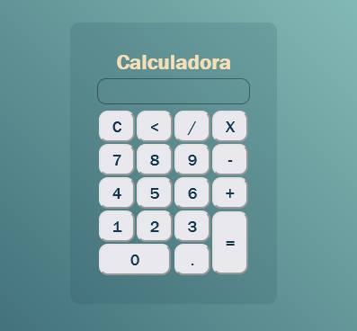

# Calculadora-basica
Calculadora de soma divisão subtração e multiplicação
## Foi utilizado nesse projeto:

- HTML

- CSS

- JavaScript

<a href="https://alessandraromualdo.github.io/Calculadora-basica">Acesse aqui</a>

